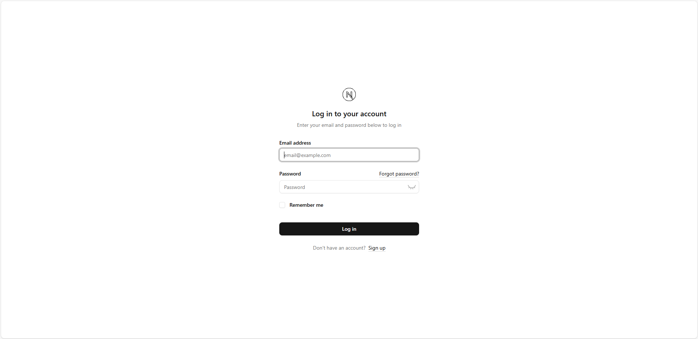
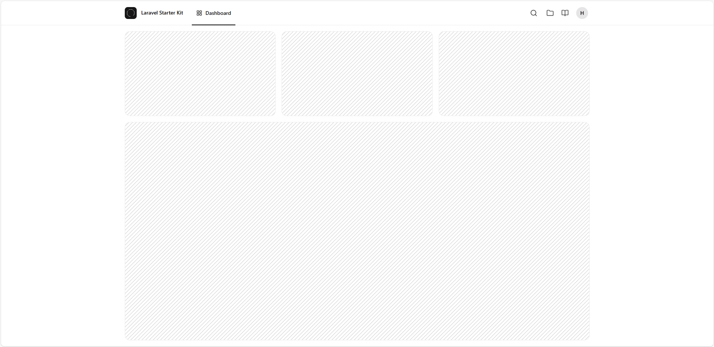

<div align="center">

  <a href="https://betofoxnet-info.vercel.app/"></a>

# BetoFoxNet


  <a href="https://nextjs.org/"></a>

## About NextJS
### Authentication!

</div>

## 👤 Admin Registration Page (Next.js + Prisma)
This project includes a protected admin registration page. The form is only accessible if no admin user exists yet in the database. It’s built with Next.js App Router, Prisma, bcrypt-ts, React Hooks, and Zod validation.

## 📁 File Structure

```bash

/app
  /register
    └── page.tsx                # Redirects if admin exists
    └── form-register-admin.tsx # Client-side admin registration form

/app/api/actions
  └── createadmin.ts           # Server-side logic for admin creation

/lib
  └── prisma.ts                # Prisma client
  └── session.ts               # Session management
  └── definitions.ts           # Zod schema definitions

```

---

## 🚦 Redirect Logic (page.tsx)

```tsx

const isUserAdmin = await prisma.user.findMany({ where: { role: 'ADMIN' } });
if (isUserAdmin.length > 0) redirect('/dashboard');

```

If an ADMIN user already exists, the user is redirected to `/dashboard`.
If not, the admin registration form is shown.

---

## 🧾 Admin Registration Form

### The form includes the following fields:

- Name

- Email

- Password

- Password confirmation

- Role (locked to ADMIN)

### Validation includes:

- Required fields

- Valid email format

- Password match

- Strong password (handled by Zod)

### UX features:

- Show/hide password toggle

- Inline error messages

- Loading spinner in the submit button

---

## 🔐 Server-side Logic (createadmin.ts)

```ts

const hashedPassword = await bcrypt.hash(password, 12);
const user = await prisma.user.create({ data: { name, email, role, password: hashedPassword } });

```

### The createAdmin function:

1. Validates form data using Zod.

2. Hashes the password with bcrypt-ts.

3. Creates the user in the database using Prisma.

4. Automatically starts a session.

On failure, it returns a generic warning that is displayed in the UI.

---

## 📋 How to Use

1. Clone this repository.

2. Set up your environment variables, especially DATABASE_URL.

3. Run the Prisma migrations:

```bash

npx prisma migrate dev

```

4. Start the development server:

```bash

npm run dev

```

5. Visit `http://localhost:3000`.

If no admin exists, the form will appear. Otherwise, you'll be redirected.

---

## ✅ Tech Stack

- Next.js (App Router)

- Prisma ORM

- Zod (form validation)

- bcrypt-ts (password hashing)

- React Hooks

- next-intl (internationalization)

- lucide-react (icons)

---

## 💡 Notes

- The registration is one-time only: only allowed if no admin exists.

- The role field is fixed to ADMIN to prevent arbitrary user types.

- All texts are localized using next-intl for multi-language support.

---

## 🧩 Overview

This login module includes:

- A server component (LoginPage) that wraps the login form in a Suspense boundary.

- A client component (LoginClient) that renders the form.

- A server action (loginUser) that handles user authentication securely on the server side.

---

### 📁 File Structure

```pgsql

/login
 ├── page.tsx                <- Server Component (LoginPage)
 ├── login-client.tsx        <- Client Component (Login)
/api/actions/loginuser.ts    <- Server Action for login

```

---

1. 🧠 LoginPage – Server Component

```tsx

import { Suspense } from 'react';
import LoginClient from './login-client';
import LoadingLoginSimple from '@/components/loadings/loading-login-simple';

export const metadata = { title: 'Log in' };

export default function LoginPage() {
    return (
        <Suspense fallback={<LoadingLoginSimple />}>
            <LoginClient />
        </Suspense>
    );
}

```

---

# 2. 🧾 LoginClient – Login Form (Client Component)

### Features:

- Controlled inputs with useState.

- Validation error messages via state.errors.

- Password visibility toggle.

- Loading feedback while submitting.

- Internationalization via next-intl.

- Redirects to /dashboard on success.

### Hooks used:

- useActionState() → Executes loginUser.

- useEffect() → Handles URL query params (like ?status=...).

- useRef() → For setting input focus.

- useRouter() → To programmatically redirect.

### Flow:

- User fills the form → submits it.

- Calls the loginUser server action via useActionState.

- Handles validation errors, messages, and redirection based on result.

---

# 3. 🔐 loginUser – Server Action

```ts

'use server';

import prisma from '@/lib/prisma';
import { compare } from 'bcrypt-ts';
import { createSession } from '@/lib/session';

export async function loginUser(state, formData) {
    const validatedFields = signInSchema.safeParse({
        email: formData.get('email'),
        password: formData.get('password'),
    });

    if (!validatedFields.success)
        return { errors: validatedFields.error.flatten().fieldErrors };

    const { email, password } = validatedFields.data;

    try {
        const user = await prisma.user.findFirst({ where: { email, deletedAt: null } });
        if (!user || !(await compare(password, user.password)))
            return { warning: 'WarningOne' };

        await createSession(user.id);
        return { message: 'Message' };
    } catch (error) {
        console.error(error);
        return { warning: 'WarningTwo' };
    }
}

```

### Key Logic:

- Validates email and password using Zod schema.

- Finds the user in the Prisma database.

- Compares hashed password using bcrypt-ts.

- If successful, creates a session.

- Returns validation errors, warnings, or a success message.

---

# 4. 🌍 Translations with `next-intl`

The form uses useTranslations('Login') for localization. Example:

```tsx

const t = useTranslations('Login');

<Label htmlFor="email">{t('EmailLabel')}</Label>

```

You’ll need translation files like:

```json

// messages/en.json
{
  "Login": {
    "Title": "Log In",
    "Description": "Welcome back! Please sign in.",
    "EmailLabel": "Email",
    "EmailPlaceholder": "Enter your email",
    "PasswordLabel": "Password",
    "PasswordPlaceholder": "Enter your password",
    "Forgot": "Forgot password?",
    "Submit": "Sign In",
    "Message": "Login successful!",
    "WarningOne": "Invalid credentials.",
    "WarningTwo": "Unexpected error. Please try again."
  }
}

```

---

# ⚙️ Setting up next-intl in next.config.js

To enable multi-language support in Next.js with next-intl, you need to use the plugin in your Next.js configuration:

```ts

// next.config.js or next.config.ts
import type { NextConfig } from 'next';
import createNextIntlPlugin from 'next-intl/plugin';

const nextConfig: NextConfig = {};
const withNextIntl = createNextIntlPlugin();

export default withNextIntl(nextConfig);


```

---

# 🧩 Using NextIntlClientProvider in the root layout

In your root layout, use NextIntlClientProvider to inject the current locale and translation messages into your application. Here’s how it fits into your RootLayout component:

```tsx

// app/layout.tsx
import type { Metadata } from 'next';
import { Geist, Geist_Mono } from 'next/font/google';
import './globals.css';
import { ThemeProvider } from '@/components/theme-provider';
import { BreadcrumbProvider } from '@/context/breadcrumb-context';
import { NextIntlClientProvider } from 'next-intl';
import { getLocale, getMessages } from 'next-intl/server';

const geistSans = Geist({ variable: '--font-geist-sans', subsets: ['latin'] });
const geistMono = Geist_Mono({ variable: '--font-geist-mono', subsets: ['latin'] });

export const metadata: Metadata = {
  title: 'Create Next App',
  description: 'Generated by create next app',
};

export default async function RootLayout({
  children,
}: Readonly<{
  children: React.ReactNode;
}>) {
  const locale = await getLocale();
  const messages = await getMessages();

  return (
    <html lang={locale} suppressHydrationWarning>
      <body className={`${geistSans.variable} ${geistMono.variable} antialiased`}>
        <ThemeProvider attribute="class" defaultTheme="system" enableSystem disableTransitionOnChange>
          <NextIntlClientProvider locale={locale} messages={messages}>
            <BreadcrumbProvider>{children}</BreadcrumbProvider>
          </NextIntlClientProvider>
        </ThemeProvider>
      </body>
    </html>
  );
}

```

---

# ✅ Requirements

To make everything work, ensure you have:

- ✅ zod for validation (signInSchema).

- ✅ bcrypt-ts for password hashing/comparison.

- ✅ prisma and a User model with fields: email, password, deletedAt.

- ✅ Session handling with createSession(user.id).

- ✅ Translation setup with next-intl.

---

# 🧪 How to Test

1. Login Failure: Try with invalid credentials → You should see an error.

2. Prefilled email: Visit a URL like ?email=test@example.com&status=created → The form is prefilled and a message is shown.

3. Password Toggle: Click the eye icon to toggle password visibility.

4. Forgot Password: Link appears only when status is not set.

5. Success: On correct login, redirects to `/dashboard`.

---

# 🛡️ Tutorial: JWT Authentication with HTTP-only Cookies in Next.js (App Router)

This authentication system uses:

- jose for JWT signing and verification

- HTTP-only cookies for secure session storage

- Next.js middleware for route protection

- Prisma ORM to fetch authenticated user data

---

# 🧱 Project Structure Overview

The system is divided into three key modules:

1. session.ts – Session management: create, verify, update, and decrypt JWTs

2. getUser.ts – Retrieves the current authenticated user from the database

3. middleware.ts – Protects routes based on session state

---

# 📦 1. session.ts – Session Management with JWT

⚙️ Initial Setup

```ts

import 'server-only';
import { SignJWT, jwtVerify } from 'jose';
import { cookies } from 'next/headers';
import { redirect } from 'next/navigation';

if (!process.env.AUTH_SECRET) throw new Error('SECRET is not defined');
const secretKey = process.env.AUTH_SECRET;
const encodedKey = new TextEncoder().encode(secretKey);

```

- Loads a secret key from the environment (AUTH_SECRET)

- This key is used to sign and verify JWTs using HS256 algorithm

---

# 🔐 createSession(userId: string)

Generates a signed JWT (valid for 15 minutes) and sets it in a secure, HTTP-only cookie named sessionAuth.

```ts

export async function createSession(userId: string): Promise<void> { ... }

```

- Cookie attributes:

  - httpOnly: can't be accessed via JavaScript

  - secure: HTTPS-only

  - sameSite: 'lax': prevents CSRF

---

# 🔎 decrypt(session: string)

Decodes and verifies the JWT token. Returns the payload or null if invalid.

```ts

export async function decrypt(session: string | undefined = '') { ... }

```

---

# ✅ verifySession()

Checks if a valid session exists. If not, redirects to /login.

```ts

export async function verifySession(): Promise<{ isAuth: boolean; userId: string; }> { ... }

```

---

# 🧾 getSession()

Returns the session payload if present, without redirecting.

```ts

export async function getSession() { ... }

```

---

# 🔄 updateSession()

If the session is close to expiring (less than 5 minutes left), this function renews it with a new token.

```ts

export async function updateSession() { ... }

```

---

# 👤 2. getUser.ts – Fetch Authenticated User

```ts

import 'server-only';
import { cache } from 'react';
import prisma from './prisma';
import { verifySession } from './session';

```

---

# 📥 getUser()

Fetches the user from the database using the ID from the session.

```ts

export const getUser = cache(async () => {
  const session = await verifySession();
  ...
});

```

- Uses Prisma to get user details

- Wrapped in cache() for server component efficiency

---

# 🌐 3. middleware.ts – Route Protection

This middleware handles redirection based on whether the user is authenticated.

```ts

import { NextRequest, NextResponse } from 'next/server';
import { updateSession } from './lib/session';

```

---

# 🔄 middleware(req: NextRequest)

- Redirects unauthenticated users away from protected routes

- Prevents logged-in users from visiting public routes like /login

```ts

export default async function middleware(req: NextRequest) { ... }

```

---

# 🎯 matcher Configuration

Only runs the middleware on relevant paths (excludes APIs and static assets):

```ts

export const config = {
  matcher: ['/((?!api|_next/static|_next/image|favicon.ico|sitemap.xml|robots.txt|videos/).*)']
}

```

---

# ✅ How to Use It in Your App

### 1. Environment Variable
In your .env file:

 ```ini

 AUTH_SECRET=your_super_secure_secret_key

```

Use a strong, random secret

---

### 2. Login Example

When a user logs in successfully:

```ts

await createSession(user.id);
redirect('/dashboard');

```

---

### 3. Logout Example

To destroy the session:

```ts

(await cookies()).set('sessionAuth', '', { expires: new Date(0) });
redirect('/login');

```

---

### 4. Use getUser() in Server Components

```ts

import { getUser } from '@/lib/getUser';

export default async function DashboardPage() {
  const user = await getUser();

  return <div>Welcome, {user?.name}</div>;
}

```

---

# 🔐 Security Notes

- JWT is stored in a secure httpOnly cookie → not accessible to JS

- Tokens are short-lived (15 min) and auto-renewed

- Session renewal is handled transparently in middleware

- All protected routes are checked on every request server-side

---

# 📌 Summary

This setup provides:

- Secure session-based authentication with JWT

- Route protection using middleware

- Prisma-based user management

- Automatic session renewal

---

#### Exchange examples:

- To use the card layout:

```tsx

import AuthLayoutTemplate from '@/components/layouts/auth/auth-card-layout';

```

<div align="center">

  

</div>

---

- To use the simple layout:

```tsx

import AuthLayoutTemplate from '@/components/layouts/auth/auth-simple-layout';

```

<div align="center">

  

</div>

---

- To use the split layout:

```tsx

import AuthLayoutTemplate from '@/components/layouts/auth/auth-split-layout';

```

<div align="center">

  

</div>

---

### ✅ Nothing else needs to be changed!

- The component will continue to function normally. The change only affects the appearance of the authentication page.

---

### 🔐 Requisitos

- Each of the templates requires:

Applying the layout with `children`, `title`, and `description` passing the correct properties to the selected layout.

---

### 🧭 Application Layout Templates

> **Page:** `/components/layouts/app-layout.tsx`

---

#### Features:
- Changing templates for the main application layout (`AppLayout`).
- Authentication support with `next-auth`: layout is only rendered if there is an active session.
- Templates receive `user` and `breadcrumbs` as props.
- Child components (`children`) are rendered within the selected layout.

---

### 📁 Available templates

| Template              | Description                                                             |
|-----------------------|-------------------------------------------------------------------------|
| `app-sidebar-layout`  | Layout with navigation sidebar — ideal for dashboards and complex apps. |
| `app-header-layout`   | Fixed header layout at the top — more compact and straightforward.      |

---

### 🔁 How to switch between templates

To change the application's main layout template, **simply replace the layout import** in the `app-layout.tsx` file.

---

#### Exchange examples:

- To use the sidebar layout:

```tsx

import AppLayoutTemplate from '@/components/layouts/app/app-sidebar-layout';

```

<div align="center">

  

</div>

---

- To use the header layout:

```tsx

import AppLayoutTemplate from '@/components/layouts/app/app-header-layout';

```

<div align="center">

  

</div>

---

### ✅ Nothing else needs to be changed

The structure remains the same. The `AppLayout` component renders the chosen layout based on the import, passing in `user`, `breadcrumbs`, and `children`.

---

### 🔒 layout Administrator

<div align="center">

  

</div>

---

<div align="center">

  

</div>

---

<div align="center">

  

</div>

---

<div align="center">

  

</div>

---

## Install packages

Node version 20+

Postgres 16+

---

```bash

git clone -b preview-staging https://github.com/HumbertoFox/next-auth-start-kit.git

```

---


```bash

npm install -g npm@11.3.0

```

---

```bash

npm install

```

---

### Environment Variables

---

```bash

NEXT_URL=
DATABASE_URL=
AUTH_SECRET=
AUTH_URL=
SMTP_HOST=
SMTP_PORT=
SMTP_USER=
SMTP_PASS=

```

---

```bash

npx prisma migrate dev

```

---

### Developed in:

---

<div>

  
  
  
  
  
  
  
  
  
  
  
  
</div>